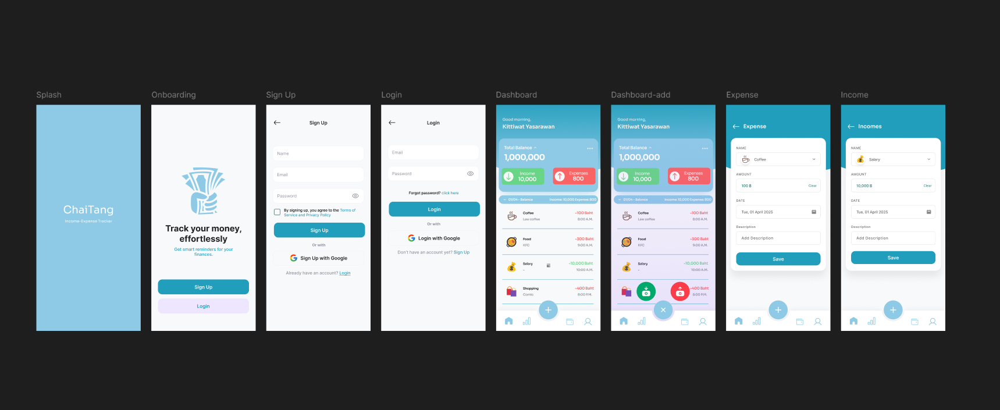

# 💸 ChaiTung(ใช้ตังค์) - Income-Expense Tracker App

ChaiTung is a mobile application designed to help you track your income and expenses. Built with **React Native** (via Expo) and **TypeScript**, it offers an user-friendly experience (currently optimized for Android).

## ⚙️ Tech Stack

- React Native (via Expo): The core framework for building the cross-platform app.
- TypeScript: Enhances code quality with static type checking.
- Expo Router: A routing solution for navigating within the app.
- React Navigation (Bottom Tabs): Provides an intuitive tab-based navigation experience.
- DateTime Picker: A component for easy date selection.
- @react-native-picker/picker: A component for dropdown menus
- react-native-chart-kit: A component for analytical charts and graphs for financial insights.
- date-fns: A library for efficient date and time manipulation.

## 📱 Screens & Functionality

- **Home**

  - Get a quick overview of your total balance, total income, total expenses, and recent transactions.

- **Add Expense**

  - Allows users to add a new expense with category, amount, date, and description.

- **Add Income**

  - Allows users to add a new income with category, amount, date, and description.

- **Statistic**

  - Visualize your financial trends with monthly bar charts for income and expenses.

- **Balance**

  - View a summary of your total account balance. This screen also allows you to filter and sort your transactions by category, making it easy to find specific entries.

- **Profile**
  - Basic user information.

## ✨ Features

- Record income and expense transactions in detail.
- Convenient date picker for selecting transaction dates.
- Clear display of transaction lists, complete with category icons and timestamps.
- Simple tab-based navigation for a smooth user experience.

## 🚀 Getting Started

1. Install Expo CLI (if you haven't already):

   ```bash
   npm install -g expo-cli

   ```

2. Install project dependencies:

   ```bash
   npm install

   ```

3. Start the development server:

   ```bash
   npm start

   ```

4. Scan the QR code with the Expo Go app to preview on your mobile device.

## 📁 Project Structure

```
📦 project-root
├── app/
│   ├── _layout.tsx           // โครงสร้างหลักของแอปและการจัดการ Routing
│   ├── index.tsx             // หน้าจอเริ่มต้น (หน้า Welcome)
│   ├── login.tsx             // หน้าจอเข้าสู่ระบบ
│   ├── add-expense.tsx       // หน้าเพิ่มรายจ่าย
│   ├── add-income.tsx        // หน้าเพิ่มรายรับ
│   └── (tabs)/               // Tab Bar
│         ├── _layout.tsx     // Layout ของ Tab Bar
│         ├── balance.tsx     // หน้าสรุปยอดเงินและรายการธุรกรรม (มีระบบ sorting)
│         ├── index.tsx       // หน้า Home (Dashboard)
│         ├── profile.tsx     // หน้า Profile
│         └── statistic.tsx   // หน้าสถิติและกราฟ
├── assets/
│   ├── images/               // รูปภาพ
│   └── icons/                // ไอคอน
├── hooks/                    // Custom Hooks
│   └── useTransactions.ts    // Hook สำหรับจัดการ Transaction และ Balance
├── lib/                      // Library/Utilities
│   ├── categoryData.ts       // ข้อมูล Category และไอคอน
│   └── storage.ts            // ระบบจัดการข้อมูล AsyncStorage
└── README.md
```

## Pre-Design (using figma)



## 👤 Author

Kittiwat Yasarawan
Computer Engineering Student – Chiang Mai University
